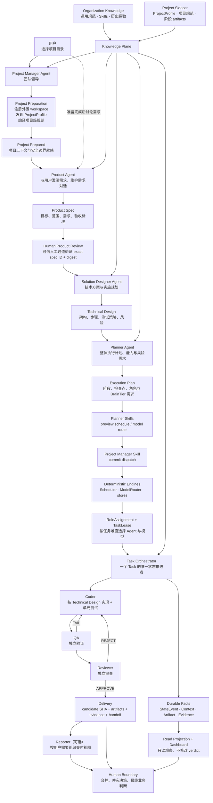

# ai-software-engineer v0.1

一个基于 Trellis 思想与 Multi-Agent 协作的、可审计的 AI 软件工程平台。

它的目标不是演示多个 Agent 互相对话，而是逐步建立一个有制度、有岗位边界、有组织记忆、
能够持续交付和自我改进的数字研发团队。

> 目标：给定一个已有 Git 项目和一条可验收需求，平台以可追溯、可复核的方式串行运行 `Coder → QA → Reviewer`，最终产出一个可合并变更或明确的阻塞原因。

## 设计原则

1. **Knowledge belongs to the organization, not the agent**：规则、设计决策、失败经验和验收标准沉淀在 `.trellis/` 与任务 artifact 中；Agent 是可替换的执行者。
2. **No agent may be the sole judge of its own work**：Coder 不能批准自己的代码；同一 Task 历史
   的 Coder、QA、Reviewer 必须是不同 Agent，并使用独立 Run、Context、worktree 和受限权限。
3. **Agents communicate through verifiable artifacts, not shared assumptions**：跨角色传递只允许使用经过 Schema 校验、带来源 revision、证据和哈希的 artifact。
4. **Task 内串行，组织层有界调度**：每个 Task 仍按 `Coder → QA → Reviewer` 串行；组织可以在
   容量允许时调度多个相互隔离 Task，不引入单 Task 复杂 DAG、共享会话或分布式队列。

## 当前进度（2026-09-02）

T001–T031 已完成。T031 新增 Solution Designer、Planner 只读资源预演，以及 Project Manager
基于权威当前事实和 exact Planner handoff 重算后，通过 Product revision fence + SQLite transaction
原子提交三角色分配；T031 相关定向测试当前为
**145 个**。当前全量质量基线为 **579 个测试**；Ruff check/format、strict Mypy、offline package build
和 `git diff --check` 全部通过。

| 阶段 | 状态 | 已交付结果 |
|---|---|---|
| M0 设计与 Bootstrap | 已完成 | 总体架构、契约、状态机、Trellis/Codex 指令、Python CLI 骨架 |
| M1 Domain + Persistence | 已完成 | 强类型领域模型、SQLite 事件事实、纯状态机、不可变 ArtifactStore |
| M2 Git + Context | 已完成 | role worktree 隔离、命令/路径策略、确定性 Context Builder/Router |
| M3 串行 Agent Loop | 已完成 | Fake/真实 AgentAdapter、`Coder → QA → Reviewer`、有界重试与恢复 |
| M4 Evaluation + Handoff | 已完成 | Evaluation events、指标/ADR 重算、DONE/BLOCKED handoff、CLI/runtime |
| 执行安全边界 | 已完成 | fail-closed 命令执行端口、role worktree 执行生命周期 |
| M5 组织 Workforce 与任意项目接入 | 已完成 | sidecar、Workforce、Scheduler/ModelRouter、ProjectProfile、SpecCompiler、Runtime workspace binding |
| M6 可执行交付 | 已完成 | evidence capture、typed tools、跨语言目标项目串行交付、只读投影/API |
| M7 Agent 可视化 | 已完成 | 静态只读 dashboard：Task board、timeline、Agent detail、Human inbox |
| M8 Project Manager 与完整 Agent 团队 | 进行中 | T028–T031 已交付准备、Product 确认、Designer/Planner 与原子分配；T032 待完成统一接单入口 |

完整阶段事实、任务清单和提交证据见
[`docs/archive/2026-09-01-t019-t022-organization-runtime.md`](docs/archive/2026-09-01-t019-t022-organization-runtime.md)；
T023–T025 的执行边界和跨语言验证见
[`docs/archive/2026-09-01-t025-target-project-e2e.md`](docs/archive/2026-09-01-t025-target-project-e2e.md)；
T026–T027 的只读投影与可视化见
[`docs/archive/2026-09-01-t026-t027-projection-visualization.md`](docs/archive/2026-09-01-t026-t027-projection-visualization.md)；
T028 的 Project Manager/Agent Skills 决策与阶段契约见
[`docs/archive/2026-09-02-t028-project-manager-stage-contracts.md`](docs/archive/2026-09-02-t028-project-manager-stage-contracts.md)；
T029 的 Project Manager preparation Skill 实现见
[`docs/archive/2026-09-02-t029-project-manager-skills.md`](docs/archive/2026-09-02-t029-project-manager-skills.md)；
T030 的 Product Agent 确认循环见
[`docs/archive/2026-09-02-t030-product-agent.md`](docs/archive/2026-09-02-t030-product-agent.md)；
T031 的 Designer、Planner 与原子 Dispatch 见
[`docs/archive/2026-09-02-t031-designer-planner-dispatch.md`](docs/archive/2026-09-02-t031-designer-planner-dispatch.md)；
后续路线见 [`docs/milestones.md`](docs/milestones.md)。

## MVP 边界

输入：

- 一个已有本地项目目录（Git 是 v0.1 的首个 Repository adapter，未来可接入其他 VCS）；
- 一条自然语言需求；Product Agent 将其整理为可评审 Product Spec，并由用户确认；
- 组织通用知识/AgentProfile/ModelPolicy，以及项目自身规范（由 sidecar 只读索引）。

输出：

- `plan`、`implementation-report`、`qa-report`、`review-report` 四类 artifact；
- ProductSpec/Approval、TechnicalDesign、ExecutionPlan 等上游团队交接 artifact；
- 一个可审计的状态事件流；
- 通过 Review 的候选分支/补丁，或 `BLOCKED` 及其证据；
- 可从事件重算的 Evaluation/ADR 报告，以及供人类直接复核的 JSON + Markdown handoff。

明确不做：单 Task 并行 Agent/DAG、共享多 Task 会话、分布式 Scheduler、向量库/RAG 平台、
自动合并保护分支、生产发布、数据库迁移编排和跨仓库事务。

## 总体架构

平台可以理解成一家数字软件公司：通用知识库与项目 sidecar 构成 Knowledge Plane，组织长期拥有
Agent 团队，Agent 通过受控 Skills 调用确定性能力。用户先选择项目目录，Project Manager Agent
完成项目准备；准备成功后，用户再与 Product Agent 讨论需求。后续由专业 Agent 按制度完成产品
定义、技术设计、执行规划、开发、测试和审查，最后把可合并候选或明确阻塞证据交给人类。



### 各层只负责什么

| 层 | 核心职责 | 明确不能做 |
|---|---|---|
| Project Manager Agent | 团队领导；通过 prepare、advance、commit-dispatch、recover、deliver Skills 接单和推进整支团队 | 不能绕过 Skill 直接写状态、分配资源或批准代码 |
| Product Agent | 与用户澄清需求，产出可评审、可追溯的版本化 Product Spec | 不能自己批准产品范围，不能持有人工决策验证权限，不能设计实现细节 |
| Solution Designer Agent | 把已确认 Product Spec 转换为 Technical Design 和实施/测试规划 | 不能改写产品需求，不能直接提交业务实现 |
| Planner Agent | 根据 Product Spec 和 Technical Design 制定整体执行计划，可用只读调度/模型预演 Skills 检查可行性 | 不能提交具体 Agent/模型，不能启动 Agent 或修改状态 |
| Agent Skills | Agent 按角色调用的 typed、policy-bound 能力接口；把请求委托给确定性 service 并返回可验证结果 | 不是 Prompt 指令，不授予 ambient store/shell 权限 |
| Scheduler / ModelRouter engines | 为 Planner preview 和 Project Manager commit-dispatch 提供同一套确定性容量、Assignment、Lease 与模型计算 | 不能生成产品/设计内容，不能修改 Task verdict |
| Task Orchestrator | 按状态机串行推进一个 Task，校验 artifact 和 retry 条件 | 不能跳过 QA/Review，不能编写业务代码 |
| Coder / QA / Reviewer | 在独立 Context、worktree 和权限下完成各自岗位工作 | 不能共享隐式记忆，不能批准自己的工作 |
| Knowledge + Evidence | 保存规范、上下文、artifact、命令、测试和模型使用证据 | 不能依赖某个 Agent 的临时会话 |
| Projection + Dashboard | 从 durable facts 重算团队和交付状态 | 只读，不能迁移状态或修改 verdict |
| Reporter（可选） | 从已验证 artifact/Handoff 生成面向用户的交付表达 | 不能创造事实、改变 verdict 或隐藏失败 |
| Human Boundary | 处理规范冲突、业务歧义、保护分支合并与生产决策 | 人工动作必须留痕，不能静默改写历史 |

## 项目结构

```text
ai-software-engineer/
├── README.md
├── AGENTS.md                         # Codex 项目级 bootstrap 指令
├── CONTEXT.md                        # 领域统一语言
├── pyproject.toml                    # Python 包、依赖与质量工具配置
├── src/ai_software_engineer/         # 控制平面 Python 包
│   ├── cli.py                        # ase 命令入口与 composition root
│   ├── domain/                       # Task、Agent、Workforce、Artifact 强类型契约
│   ├── store/                        # SQLite Task 快照与 StateEvent 日志
│   ├── artifacts/                    # 原子 JSON ArtifactStore 与 SHA-256
│   ├── git/                          # role worktree 隔离与 path/command policy
│   ├── context/                      # 确定、脱敏、预算受限的 Context Builder/Router
│   ├── agents/                       # AgentAdapter、Fake 与 OpenAI-compatible adapter
│   ├── orchestration/                # 串行 runner、Context composition 与状态机
│   ├── scheduling/                   # 纯 PortfolioScheduler 与 run-scoped ModelRouter
│   ├── runtime.py                    # RuntimeConfig、角色路由与 task run composition
│   ├── runtime_workspace.py           # 组织/项目 workspace 绑定与 workforce 解析
│   ├── project_manager/               # prepare、阶段授权、当前事实重算与原子 dispatch
│   ├── product/                       # Product context/adapter、确认循环、不可变事实与重放
│   ├── design/                        # Designer context/adapter、TechnicalDesign 与恢复 checkpoint
│   ├── planning/                      # Planner context/adapter、ExecutionPlan store 与只读 preview
│   ├── projection/                    # 从 durable facts 重算只读 Task/Run/Agent/Lease
│   ├── read_api.py                    # transport-neutral GET-only projection API
│   ├── visualization/                 # 无依赖静态只读 dashboard renderer
│   ├── project_profile.py            # 技术栈、VCS 与项目原生规则只读发现
│   ├── spec_compiler.py              # 三层规范编译、冲突与人工 resolution
│   ├── execution.py                  # worktree 内受控 argv/subprocess 执行端口
│   ├── evidence/                     # 脱敏、带 SHA 的 command/diff/test/usage 证据
│   ├── tools/                        # role/run 绑定的 typed tool protocol
│   ├── role_workspace.py             # Git worktree + executor 生命周期组合
│   ├── project_workspace.py           # 目标项目与外置 AI sidecar workspace 绑定
│   ├── evaluation/                   # Evaluation events、metrics/ADR、handoff
│   └── prompts/                      # 后续：版本化 role prompt 模板
├── docs/
│   ├── architecture.md               # 分层、边界和部署形态
│   ├── tech-stack.md                 # 技术选型与取舍
│   ├── state-machine.md              # 状态、事件与迁移守卫
│   ├── contracts.md                  # 角色与 artifact 契约
│   ├── prompt-protocol.md            # 可直接模板化的 role prompts
│   ├── context-routing.md            # Context Builder/Router
│   ├── git-worktree.md               # 隔离、分支与合并策略
│   ├── orchestration.md              # 核心流程与伪代码
│   ├── failure-routing.md            # 失败分类、重试与升级
│   ├── evaluation.md                 # 指标与 Autonomous Delivery Rate
│   ├── cli.md                        # CLI 使用说明
│   ├── runtime.md                    # Runtime 配置与 task run
│   ├── tool-protocol.md              # T024 typed tool 与角色隔离
│   ├── target-project-e2e.md          # T025 跨语言目标项目验证
│   ├── projection.md                  # T026 事件驱动只读 projection/read API
│   ├── visualization-implementation.md # T027 dashboard renderer
│   ├── milestones.md                 # 里程碑与第一批任务
│   ├── archive/                      # 已完成阶段的事实、验证与提交记录
│   └── decisions/                    # 已接受的架构决策
├── schemas/
│   ├── task.schema.json
│   ├── agent.schema.json
│   ├── artifact.schema.json
│   ├── plan.schema.json
│   ├── implementation-report.schema.json
│   ├── qa-report.schema.json
│   ├── review-report.schema.json
│   ├── context.schema.json
│   ├── state-event.schema.json
│   ├── evaluation-event.schema.json
│   ├── handoff-bundle.schema.json
│   ├── runtime-config.schema.json
│   ├── project-workspace.schema.json
│   ├── workforce.schema.json
│   ├── project-profile.schema.json
│   ├── spec-conflict.schema.json
│   ├── spec-resolution.schema.json
│   ├── runtime-workspace-binding.schema.json
│   ├── evidence.schema.json
│   ├── run-evidence-manifest.schema.json
│   ├── tool-request.schema.json
│   ├── tool-result.schema.json
│   ├── projection-timeline.schema.json
│   ├── projection-task.schema.json
│   ├── projection-run.schema.json
│   ├── projection-agent.schema.json
│   ├── projection-lease.schema.json
│   ├── projection-snapshot.schema.json
│   ├── product-agent-run.schema.json
│   ├── product-context.schema.json
│   ├── product-dialogue.schema.json
│   ├── product-discovery-checkpoint.schema.json
│   ├── designer-context.schema.json
│   ├── designer-agent-run.schema.json
│   ├── planner-context.schema.json
│   ├── planner-agent-run.schema.json
│   ├── planner-preview.schema.json
│   └── dispatch-commit.schema.json
├── .trellis/
│   ├── README.md
│   └── spec/core/
│       ├── architecture.md
│       ├── contracts.md
│       └── python-runtime.md
├── tests/
│   ├── domain/                       # 单对象不变量和权限边界
│   ├── context/                      # 路由、预算、脱敏和注入边界
│   ├── agents/                       # Fake/real AgentAdapter 共用契约
│   ├── orchestration/                # 串行交付闭环与状态 checkpoint
│   ├── evaluation/                   # 事件重放、ADR 与 DONE/BLOCKED handoff
│   ├── runtime/                      # RuntimeSession 与 fake adapter composition
│   ├── scheduling/                   # capacity、priority、independence 与模型路由
│   ├── project_profile/              # 跨语言发现、完整性与路径边界
│   ├── spec_compiler/                # 冲突、resolution 与不可变记录
│   ├── runtime_workspace/            # workspace/binding/allocation 组合契约
│   ├── project_manager/              # baseline、prepare/replay、stage gate 与跨语言接入
│   ├── product/                      # Product model/store/context/adapter/service 契约
│   ├── execution/                    # 命令 allowlist、环境和 timeout 测试
│   ├── role_workspace/               # role worktree 与 executor 组合测试
│   ├── evidence/                     # evidence capture、脱敏、重放和完整性
│   ├── tools/                        # typed tool protocol 和角色隔离
│   ├── e2e/                          # 跨语言目标项目串行交付
│   └── contracts/                    # Python model ↔ JSON Schema 一致性
└── artifacts/runs/                   # 运行产物（默认 gitignored）
```

## Workspace 分工

平台把代码、项目运行事实和组织成员彻底分开，避免污染目标项目，也避免把 Agent 错误地绑定给
某一个项目。

| 位置 | 保存内容 | 谁拥有 |
|---|---|---|
| 目标项目目录 | 业务代码、测试、构建文件、项目原生规范 | 原项目 |
| Project sidecar | ProjectProfile、Product 对话/需求/Spec/批准/checkpoint/operation、Assignment、Task/StateEvent、Context、Artifact、Evidence、Handoff | 当前项目 |
| Organization workspace | AgentProfile、ModelPolicy、WorkQueue、Lease、跨项目绩效 | AI 软件工程团队 |

目标项目代码目录之外，平台为每个项目建立固定的 sidecar workspace；这些目录不会写入目标项目：

```text
<ai-workspace-root>/<project-id>/
├── workspace.json
├── profile/ assignments/ knowledge/ policy/ state/
├── artifacts/ contexts/ evidence/ evaluations/
├── handoffs/ runs/ locks/ logs/ spec-conflicts/
```

目标项目仍是代码、测试和构建命令的默认 cwd；sidecar 只保存项目元数据、Assignment 和可审计
事实。AgentProfile 不属于项目，组织级数据采用独立 workspace：

```text
<organization-workspace>/
├── organization.json
├── agents/ model-policies/ work-items/
└── leases/ metrics/
```

项目原生规范会被索引和引用，不会被平台静默覆盖；规范冲突进入人工处理队列。

当前架构只有这一种所有权模型：AgentProfile 属于组织，Project sidecar 只保存 Assignment 和项目
运行事实。T029 已将 `ProjectWorkspaceRegistry + ProjectProfile + RuntimeWorkspaceBinder`
和 task-free project baseline compiler 封装为 Project Manager Agent 的 `prepare_project` Python
Skill seam；调用方只传绝对项目目录。T030 又把需求对话、ProjectRequest 修订、
ProductSpec 版本、人工批准、checkpoint 和 operation receipt 封存为 sidecar 下的不可变
事实链。T031 已把 approved ProductSpec 继续转换为 TechnicalDesign、抽象 ExecutionPlan、只读
资源预演和原子 dispatch bundle。统一 CLI 接单入口仍属于 T032。

## 推荐的 v0.1 运行形态

- 单机 CLI + Python 进程；
- SQLite 保存 Task、状态事件和 artifact 索引；文件系统保存 artifact 正文；
- Git CLI 管理 worktree；
- 模型通过一个 `AgentAdapter` 接口接入，默认支持 OpenAI-compatible endpoint；
- 每次 Agent 运行都有超时、token budget、最大重试次数和可复现的 context manifest。

具体选择和理由见 [`docs/tech-stack.md`](docs/tech-stack.md)。

## 开发环境

```bash
uv sync
uv run ase --help
uv run pytest
uv run ruff check .
uv run mypy src tests
```

项目使用 Python 3.12+。uv 会读取 `.python-version` 并建立隔离环境；`ase` 是平台 CLI 入口。

## 当前如何使用

当前版本首先是一套可运行、可测试、可扩展的控制平面基础，而不是已经能够对任意项目全自动
改码交付的最终产品。现阶段可以：

- 用 `ase task create/show/events` 创建和审计强类型 Task；
- 用 `ase task run` 按固定顺序运行配置驱动的 Coder、QA、Reviewer；
- 用 `ase evaluation report` 从 durable facts 重算指标和 ADR；
- 用 `ase handoff build` 为 `DONE/BLOCKED` Task 生成 JSON + Markdown 交付包；
- 在 Python application seam 中注册任意本地项目的外置 sidecar workspace；
- 只读发现语言、构建系统、VCS 和项目原生规范来源，并以 URI/hash 形成 ProjectProfile；
- 用 SpecCompiler 编译结构化组织/项目/Task 规则，冲突时生成 `WAITING_HUMAN` 路由和不可变 resolution；
- 用 AgentProfile、WorkItem、RoleAssignment、TaskLease、ModelPolicy、ModelSelection 和
  AgentRunAllocation 表达组织成员、容量和 run-scoped 大脑；
- 用 PortfolioScheduler/ModelRouter 做确定、可重放的 Assignment/Lease 与模型选择决策；
- 在 Python application seam 中绑定组织/项目 workspace，并解析 run-scoped AgentDefinition；
- 用 typed tool protocol 和 EvidenceStore 约束并封存文件、命令、diff、测试及模型 usage；
- 用跨语言 fixture 验证 Python、Java、Go、TypeScript 项目的隔离交付边界；
- 从 durable facts 重算 projection，并输出只读 JSON/静态 dashboard。
- 用 ProjectPreparation、ProjectRequest、ProductSpec/Approval、TechnicalDesign 和 ExecutionPlan
  typed contracts 表达上游团队交接；只有用户批准的精确 Product Spec 和完整阶段链才能派生 Task。
- 在 Python application seam 中调用 `ProjectManagerSkillService.prepare_project(...)`：只给绝对
  项目目录，即可注册/重开外置 sidecar、发现 ProjectProfile、绑定组织并编译不含
  Task 假设的项目基线；冲突返回 `WAITING_HUMAN`，成功返回可重放的
  `ProjectPreparation`。
- 启动 Product Agent 前调用同一 service 的 `require_product_context(...)`；该门禁会重新
  prepare/reopen sidecar 并复核 current profile、binding 与 baseline，不信任调用方持有的
  过期 result。Agent-visible wire contract 为
  `schemas/agent-skill-project-manager.schema.json`。
- 在 Python application seam 中使用 `ProductDiscoveryService` 运行需求澄清循环：人类与
  Product Agent 的每次消息、ProjectRequest 修订、ProductSpec 版本、ProductSpecApproval、
  checkpoint 和 operation receipt 都是带 SHA-256 的 append-only 事实。
- 人工决策命令只提交 `approval_reference`；只有与 Product Agent 隔离的
  `HumanProductDecisionVerifier` 能解析出操作人、决策、理由和时间，并绑定 exact spec ID/digest。
  `APPROVED` 还必须通过 Project Manager `advance_stage` 对当前事实的重新校验。
- 同一 operation ID + typed command 可在进程重启后精确重放；operation receipt 保存预期
  checkpoint，因此在事实已写入但 checkpoint 尚未发布时也能恢复，变更同一
  operation 的输入则 fail closed。

最小 CLI 流程：

```bash
uv sync
uv run ase task create --file task.json --database /path/to/ai-workspace/state/state.sqlite3
export OPENAI_API_KEY='...'
uv run ase task run <task-id> --config runtime.json
uv run ase handoff build <task-id> \
  --database /path/to/ai-workspace/state/state.sqlite3 \
  --artifacts /path/to/ai-workspace/artifacts \
  --output /path/to/ai-workspace/handoffs
```

当前 CLI 尚未自动发现并绑定 workspace。使用 CLI 时，外部目标项目的 state、artifact、context、
evaluation 和 handoff 路径仍必须显式指向 sidecar，避免污染目标项目；Python application 可用
T029 的 `ProjectManagerSkillService.prepare_project(...)` 完成 prepare，并用 T022 的
`RuntimeWorkspaceBinding.compose_runtime_config(...)` 完成后续装配。配置示例和字段说明见
[`docs/runtime.md`](docs/runtime.md) 与 [`docs/cli.md`](docs/cli.md)。

当前最大的产品缺口不是底层组件，而是统一接单入口：T029–T031 已分别完成 prepare、可恢复的
Product 确认、Designer/Planner 与调度提交；但 CLI 还没有把这些能力和现有交付循环连成一条
用户流程。T032 将实现“项目目录 + 需求”的统一
CLI/E2E，使项目注册、规范编译、Task 创建、团队分配和串行交付自动衔接。持久化 WorkQueue 后台
循环、自动 merge 保护分支和生产部署仍不在当前能力内。

## 文档导航

- 架构与边界：[`docs/architecture.md`](docs/architecture.md)
- 状态机：[`docs/state-machine.md`](docs/state-machine.md)
- 契约与权限：[`docs/contracts.md`](docs/contracts.md)
- Prompt 协议：[`docs/prompt-protocol.md`](docs/prompt-protocol.md)
- Context：[`docs/context-routing.md`](docs/context-routing.md)
- Git 隔离：[`docs/git-worktree.md`](docs/git-worktree.md)
- Orchestrator：[`docs/orchestration.md`](docs/orchestration.md)
- 失败路由：[`docs/failure-routing.md`](docs/failure-routing.md)
- 评估：[`docs/evaluation.md`](docs/evaluation.md)
- CLI 使用：[`docs/cli.md`](docs/cli.md)
- Runtime 配置与 task run：[`docs/runtime.md`](docs/runtime.md)
- Project workspace 与 Agent 工作可视化：[`docs/visualization.md`](docs/visualization.md)
- 里程碑：[`docs/milestones.md`](docs/milestones.md)
- 阶段归档：[`docs/archive/README.md`](docs/archive/README.md)
- 语言架构决策：[`docs/decisions/0001-python-control-plane.md`](docs/decisions/0001-python-control-plane.md)
- Agent Workforce 决策：[`docs/decisions/0002-organization-owned-agent-workforce.md`](docs/decisions/0002-organization-owned-agent-workforce.md)
- Codex bootstrap：[`AGENTS.md`](AGENTS.md)
