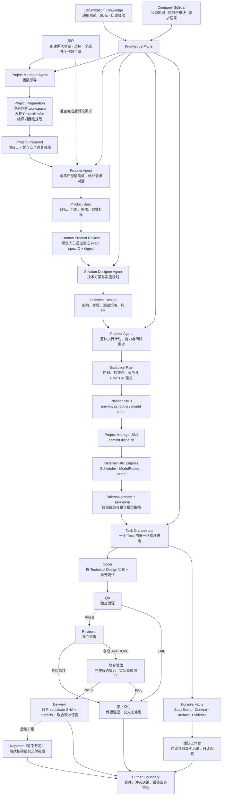

# ai-software-engineer v0.1

一个基于 Trellis 思想与 Multi-Agent 协作的、可审计的通用 AI 软件工程团队平台。

团队不绑定某家公司、业务领域或技术栈。你提供项目目录和需求，团队学习对应项目的规范后开展工作；
同一支 Agent 团队可以服务不同项目，项目之间的知识、上下文和交付记录保持隔离。

它的目标不是演示多个 Agent 互相对话，而是逐步建立一个有制度、有岗位边界、有组织记忆、
能够持续交付和自我改进的数字研发团队。

> 先为一个需求选择一个或多个代码目录，平台准备好项目规范后再与你聊需求。你确认产品文档后，团队按仓库执行 `Coder → QA → Reviewer`，最后联合验证，交付候选提交和证据，或明确的阻塞原因。

## 设计原则

1. **Knowledge belongs to the organization, not the agent**：规则、设计决策、失败经验和验收标准沉淀在 `.trellis/` 与任务 artifact 中；Agent 是可替换的执行者。
2. **No agent may be the sole judge of its own work**：Coder 不能批准自己的代码；同一 Task 历史
   的 Coder、QA、Reviewer 必须是不同 Agent，并使用独立 Run、Context、worktree 和受限权限。
3. **Agents communicate through verifiable artifacts, not shared assumptions**：跨角色传递只允许使用经过 Schema 校验、带来源 revision、证据和哈希的 artifact。
4. **Task 内串行，组织层有界调度**：每个 Task 仍按 `Coder → QA → Reviewer` 串行；组织可以在
   容量约束下分配多个相互隔离 Task，不引入单 Task 复杂 DAG、共享会话或分布式队列。
   当前已有分配与调度算法，但尚无常驻任务队列，阻塞后不会自动切换下一项工作。

## MVP 边界

输入：

- 一个或多个已有本地代码目录，可以属于同一仓库、不同仓库或不同业务项目（当前交付使用 Git）；
- 一条自然语言需求；Product Agent 将其整理为可评审 Product Spec，并由用户确认；
- 组织通用知识/AgentProfile/ModelPolicy，以及项目自身规范（由 sidecar 只读索引）。

日常 `ase request ...` 入口的交付结果：

- `plan`、`implementation-report`、`qa-report`、`review-report` 四类 artifact；
- ProductSpec/Approval、TechnicalDesign、ExecutionPlan 等上游团队交接 artifact；
- 一个可审计的状态事件流；
- 各仓通过 QA/Review 的候选提交与联合验收记录，或阻塞状态及其证据；
- CLI 返回结构化 checkpoint，团队工作台提供任务、模型调用与报告的只读视图。

底层另外提供 Evaluation/ADR 重算与 JSON + Markdown Handoff 能力；不能据此认为日常
request 命令已经自动生成完整评估与交付汇总报告。Reporter 仍暂不开发。

通用性指不绑定具体业务与目标项目语言，并非已支持所有运行环境：当前代码交付要求本地 Git
仓库、可用的构建/测试依赖及受控命令，生产存储使用 MySQL。

明确不做：单 Task 并行 Agent/DAG、共享多 Task 会话、分布式 Scheduler、向量库/RAG 平台、
自动合并保护分支、生产发布、数据库迁移编排和跨仓库事务。

## 总体架构

平台由通用知识库、可切换的工作知识库和组织长期拥有的 Agent 团队组成。
当前实现用 Company sidecar 收纳服务对象的共享知识、项目知识子模块和需求记录，
它是知识与工作记录的隔离边界，不是把团队绑定到某家公司的产品限制。
Agent 通过受控 Skills 调用确定性能力。用户先选择项目目录，Project Manager Agent
完成项目准备；准备成功后，用户再与 Product Agent 讨论需求。后续由专业 Agent 按制度完成产品
定义、技术设计、执行规划、开发、测试和审查，最后把可合并候选或明确阻塞证据交给人类。

下图以当前生产入口为准。底层 Runtime 已有有界返工能力，但生产入口目前每个交付角色只尝试
一次；QA/Review 不通过时保留失败证据并停止，尚未接通完整的自动返工循环。



模型路由引擎具备风险与能力约束，但当前生产 Host 使用配置中首个启用模型作为主模型，
默认策略对各风险等级采用同一档位；额度或临时故障时才按规则尝试备用路由。
这不是已经实现按任务难度自动选择不同成本/能力模型的完整策略。

### 各层只负责什么

| 层 | 核心职责 | 明确不能做 |
|---|---|---|
| Project Manager Agent | 团队领导；通过 prepare、advance、commit-dispatch、recover、deliver Skills 接单和推进整支团队 | 不能绕过 Skill 直接写状态、分配资源或批准代码 |
| Product Agent | 与用户澄清需求，产出可评审、可追溯的版本化 Product Spec | 不能自己批准产品范围，不能持有人工决策验证权限，不能设计实现细节 |
| Solution Designer Agent | 把已确认 Product Spec 转换为 Technical Design 和实施/测试规划 | 不能改写产品需求，不能直接提交业务实现 |
| Planner Agent | 根据 Product Spec 和 Technical Design 制定整体执行计划，可用只读调度/模型预演 Skills 检查可行性 | 不能提交具体 Agent/模型，不能启动 Agent 或修改状态 |
| Agent Skills | Agent 按角色调用的 typed、policy-bound 能力接口；把请求委托给确定性 service 并返回可验证结果 | 不是 Prompt 指令，不授予 ambient store/shell 权限 |
| Scheduler / ModelRouter engines | 为 Planner preview 和 Project Manager commit-dispatch 提供同一套确定性容量、Assignment、Lease 与模型计算 | 不能生成产品/设计内容，不能修改 Task verdict |
| Task Orchestrator | 按状态机串行推进一个 Task，校验 artifact 和 retry 条件 | 不能跳过 QA/Review，不能编写业务代码 |
| Coder / QA / Reviewer | 在独立 Context、worktree 和权限下完成各自岗位工作 | 不能共享隐式记忆，不能批准自己的工作 |
| Knowledge + Evidence | 保存规范、上下文、artifact、命令、测试和模型使用证据 | 不能依赖某个 Agent 的临时会话 |
| Projection + Dashboard | 从 durable facts 重算团队和交付状态 | 只读，不能迁移状态或修改 verdict |
| Reporter（暂不开发） | 后续从已验证 artifact/Handoff 生成面向用户的交付表达 | 不能创造事实、改变 verdict 或隐藏失败 |
| Human Boundary | 处理规范冲突、业务歧义、保护分支合并与生产决策 | 人工动作必须留痕，不能静默改写历史 |

## 项目结构

```text
ai-software-engineer/
├── README.md
├── AGENTS.md                         # Codex 项目级 bootstrap 指令
├── CONTEXT.md                        # 领域统一语言
├── pyproject.toml                    # Python 包、依赖与质量工具配置
├── src/ai_software_engineer/         # 控制平面 Python 包
│   ├── cli.py                        # ase 命令入口与 composition root
│   ├── domain/                       # Task、Agent、Workforce、Artifact 强类型契约
│   ├── store/                        # MySQL 生产存储与 SQLite 兼容存储
│   ├── artifacts/                    # 原子 JSON ArtifactStore 与 SHA-256
│   ├── git/                          # role worktree 隔离与 path/command policy
│   ├── context/                      # 确定、脱敏、预算受限的 Context Builder/Router
│   ├── agents/                       # Codex/Responses/Fallback/Fake typed adapters
│   ├── orchestration/                # 串行 runner、Context composition 与状态机
│   ├── scheduling/                   # 纯 PortfolioScheduler 与 run-scoped ModelRouter
│   ├── runtime.py                    # RuntimeConfig、角色路由与 task run composition
│   ├── runtime_workspace.py           # 组织/项目 workspace 绑定与 workforce 解析
│   ├── project_manager/               # prepare、阶段授权、当前事实重算与原子 dispatch
│   ├── multi_directory/               # 联合 scope、产品/方案/计划、原生投影和候选集验收
│   ├── company_workspace.py           # 公司 sidecar、项目子模块、按需知识选择
│   ├── config/                        # 无 secret 的 Production Team Host 配置
│   ├── product/                       # Product context/adapter、确认循环、不可变事实与重放
│   ├── design/                        # Designer context/adapter、TechnicalDesign 与恢复 checkpoint
│   ├── planning/                      # Planner context/adapter、ExecutionPlan store 与只读 preview
│   ├── projection/                    # 从 durable facts 重算只读 Task/Run/Agent/Lease
│   ├── read_api.py                    # transport-neutral GET-only projection API
│   ├── visualization/                 # 底层静态只读 dashboard renderer
│   ├── team_view/                     # 真实数据团队工作台、只读 HTTP 服务和网页
│   ├── project_profile.py            # 技术栈、VCS 与项目原生规则只读发现
│   ├── spec_compiler.py              # 三层规范编译、冲突与人工 resolution
│   ├── execution.py                  # worktree 内受控 argv/subprocess 执行端口
│   ├── evidence/                     # 脱敏、带 SHA 的 command/diff/test/usage 证据
│   ├── tools/                        # role/run 绑定的 typed tool protocol
│   ├── role_workspace.py             # Git worktree + executor 生命周期组合
│   ├── project_workspace.py           # 目标项目与外置 AI sidecar workspace 绑定
│   ├── evaluation/                   # Evaluation events、metrics/ADR、handoff
│   └── prompts/                      # 后续：版本化 role prompt 模板
├── docs/
│   ├── architecture.md               # 分层、边界和部署形态
│   ├── tech-stack.md                 # 技术选型与取舍
│   ├── state-machine.md              # 状态、事件与迁移守卫
│   ├── contracts.md                  # 角色与 artifact 契约
│   ├── prompt-protocol.md            # 可直接模板化的 role prompts
│   ├── context-routing.md            # Context Builder/Router
│   ├── git-worktree.md               # 隔离、分支与合并策略
│   ├── orchestration.md              # 核心流程与伪代码
│   ├── failure-routing.md            # 失败分类、重试与升级
│   ├── evaluation.md                 # 指标与 Autonomous Delivery Rate
│   ├── cli.md                        # CLI 使用说明
│   ├── runtime.md                    # Runtime 配置与 task run
│   ├── tool-protocol.md              # T024 typed tool 与角色隔离
│   ├── target-project-e2e.md          # T025 跨语言目标项目验证
│   ├── projection.md                  # T026 事件驱动只读 projection/read API
│   ├── visualization-implementation.md # T027 dashboard renderer
│   ├── milestones.md                 # 里程碑与第一批任务
│   ├── archive/                      # 已完成阶段的事实、验证与提交记录
│   └── decisions/                    # 已接受的架构决策
├── schemas/
│   ├── task.schema.json
│   ├── agent.schema.json
│   ├── artifact.schema.json
│   ├── plan.schema.json
│   ├── implementation-report.schema.json
│   ├── qa-report.schema.json
│   ├── review-report.schema.json
│   ├── context.schema.json
│   ├── state-event.schema.json
│   ├── evaluation-event.schema.json
│   ├── handoff-bundle.schema.json
│   ├── runtime-config.schema.json
│   ├── project-workspace.schema.json
│   ├── workforce.schema.json
│   ├── project-profile.schema.json
│   ├── spec-conflict.schema.json
│   ├── spec-resolution.schema.json
│   ├── runtime-workspace-binding.schema.json
│   ├── evidence.schema.json
│   ├── run-evidence-manifest.schema.json
│   ├── tool-request.schema.json
│   ├── tool-result.schema.json
│   ├── projection-timeline.schema.json
│   ├── projection-task.schema.json
│   ├── projection-run.schema.json
│   ├── projection-agent.schema.json
│   ├── projection-lease.schema.json
│   ├── team-snapshot.schema.json
│   ├── projection-snapshot.schema.json
│   ├── product-agent-run.schema.json
│   ├── product-context.schema.json
│   ├── product-dialogue.schema.json
│   ├── product-discovery-checkpoint.schema.json
│   ├── designer-context.schema.json
│   ├── designer-agent-run.schema.json
│   ├── planner-context.schema.json
│   ├── planner-agent-run.schema.json
│   ├── planner-preview.schema.json
│   └── dispatch-commit.schema.json
├── .trellis/
│   ├── README.md
│   └── spec/core/
│       ├── architecture.md
│       ├── contracts.md
│       └── python-runtime.md
├── tests/
│   ├── domain/                       # 单对象不变量和权限边界
│   ├── context/                      # 路由、预算、脱敏和注入边界
│   ├── agents/                       # Fake/real AgentAdapter 共用契约
│   ├── orchestration/                # 串行交付闭环与状态 checkpoint
│   ├── evaluation/                   # 事件重放、ADR 与 DONE/BLOCKED handoff
│   ├── runtime/                      # RuntimeSession 与 fake adapter composition
│   ├── scheduling/                   # capacity、priority、independence 与模型路由
│   ├── project_profile/              # 跨语言发现、完整性与路径边界
│   ├── spec_compiler/                # 冲突、resolution 与不可变记录
│   ├── runtime_workspace/            # workspace/binding/allocation 组合契约
│   ├── project_manager/              # baseline、prepare/replay、stage gate 与跨语言接入
│   ├── product/                      # Product model/store/context/adapter/service 契约
│   ├── execution/                    # 命令 allowlist、环境和 timeout 测试
│   ├── role_workspace/               # role worktree 与 executor 组合测试
│   ├── evidence/                     # evidence capture、脱敏、重放和完整性
│   ├── tools/                        # typed tool protocol 和角色隔离
│   ├── e2e/                          # 跨语言目标项目串行交付
│   └── contracts/                    # Python model ↔ JSON Schema 一致性
└── artifacts/runs/                   # 运行产物（默认 gitignored）
```

## Workspace 分工

平台把代码、项目运行事实和组织成员彻底分开，避免污染目标项目，也避免把 Agent 错误地绑定给
某一个项目。

以下 `Company` 是当前实现中的知识隔离容器名称。初次使用可以保留默认 `company_default`，
不必先定义真实公司或业务团队；需要服务不同公司时再分开配置知识库，Agent 仍由组织统一拥有。

| 位置 | 保存内容 | 谁拥有 |
|---|---|---|
| 目标项目目录 | 业务代码、测试、构建文件、项目原生规范 | 原项目 |
| Company sidecar | 公司公共知识、项目知识子模块、需求项目记录 | 当前公司 |
| 公司内的项目子模块 | ProjectProfile、原生规范引用、架构知识，以及每仓 Task/Artifact/Evidence 等运行事实 | 当前公司的项目 |
| Organization workspace | AgentProfile、ModelPolicy 与组织级分配契约；WorkQueue、跨项目绩效的组织归属与扩展位置 | AI 软件工程团队 |

每家公司只需一个外置 sidecar，项目作为内部子模块收纳，不复制源码：

```text
<platform_root>/companies/<company_id>/
├── company.json
├── knowledge/                       # 公司级共享知识
├── projects/<project-id>/            # 项目知识与每仓运行事实
│   ├── workspace.json
│   └── profile/ knowledge/ state/ contexts/ artifacts/ evidence/ ...
└── requests/                        # 需求项目的联合记录
```

目标项目仍是代码、测试和构建命令的默认 cwd；sidecar 只保存项目元数据、Assignment 和可审计
事实。AgentProfile 不属于项目，组织级数据采用独立 workspace：

```text
<organization-workspace>/
├── organization.json
├── agents/ model-policies/ work-items/
└── leases/ metrics/
```

目录或契约存在不代表后台服务已经实现：生产 Task/dispatch/Lease 权威事实保存在 MySQL，
目前没有常驻 WorkQueue 消费者，也不将这些目录视为已运行的自动排队或绩效汇总服务。

项目原生规范会被索引和引用，不会被平台静默覆盖；规范冲突会记录并等待人工处理。
公司知识按显式选择加载，并做脱敏与来源校验；不会自动加载其他公司或无关项目的资料。
`requests/` 保存一份联合产品文档、批准记录、技术方案、执行计划、各仓候选和联合验收证据。
同仓多个模块合并执行，但写入不能超出所选范围；参考仓库可以只读，不必产生代码改动。

## 推荐的 v0.1 运行形态

- 单机 `ase` CLI + Python 进程；Team Host 随命令装配，非后台守护服务，中断后需显式 resume；
- MySQL 8.0 保存生产 Task、StateEvent、Assignment、Lease 和 dispatch fence；
- 外置文件系统保存 organization workspace、项目 sidecar、Context、Artifact 和 Evidence；
- Git worktree 隔离 Coder、QA、Reviewer，目标项目主 checkout 保持不变；
- 已登录 Codex CLI 使用 `gpt-5.5`，备用优先级为 DeepSeek → Qianwen（千问），需显式配置 Responses-compatible 路由；
- SQLite 只保留给底层 Runtime、离线测试和兼容场景，不是正常项目接单的生产存储。

具体选择和理由见 [`docs/tech-stack.md`](docs/tech-stack.md)。

## 最新使用方法

**第一次配置好环境，以后只需要：选目录 → 聊需求 → 确认 → 查看交付。**
现在通过 CLI 操作需求，网页用于查看进度；下面的命令都在平台仓库目录执行。

### 1. 首次配置（只做一次）

准备 Python 3.12+、uv、Git、MySQL 8.0，以及已登录的 Codex CLI，然后安装依赖：

```bash
uv sync
```

按 [首次配置指南](docs/production-setup.md) 完成以下三项，已有 MySQL 容器可以直接使用：

- 连接 MySQL：设置 `ASE_MYSQL_DSN`。
- 配置数据目录：复制示例配置，将 `platform_root` 设为所有代码目录之外的绝对路径；公司字段可先保留默认值。
- 启用模型：将 `live_model_execution` 设为 true，默认使用 GPT-5.5；备用顺序为 DeepSeek、千问，需另行配置启用。

配置默认读取 `~/.config/ai-software-engineer/config.json`；其他位置用 `ASE_CONFIG` 指定。
新终端需设置相同的环境变量。密钥不要写入配置文件或提交到仓库。

### 2. 日常使用：创建、讨论、确认

**① 选择本次需求涉及的代码目录。**只改一个项目就传一个目录；涉及多个项目就一起传入：

```bash
uv run ase request create /absolute/path/to/project-a /absolute/path/to/project-b \
  --name "你的需求名称"
```

目录可以不相邻，也可以是仓库内的模块；目标 Git 仓库需有已提交的 HEAD 和干净工作树。
平台先准备项目、读取规范，成功后返回 `READY_FOR_DISCUSSION`，这一步不调用模型。

**② 告诉产品 Agent 要做什么。**把以下 `DELIVERY_ID` 和 `CHECKPOINT` 分别替换为输出中
`checkpoint.delivery_id` 和 `checkpoint.checkpoint_sha256` 的值：

```bash
uv run ase request discuss DELIVERY_ID \
  --checkpoint CHECKPOINT \
  --message "描述你要解决的问题、期望结果，以及已知的限制和验收要求"
```

如果产品 Agent 提问，继续用 discuss 回答；每次使用**最新返回的 CHECKPOINT**。
问题在 `checkpoint.dialogue`，产品文档在 `checkpoint.product_spec`。

**③ 确认产品文档，启动交付。**状态为 `WAITING_PRODUCT_APPROVAL` 时，
阅读范围和验收标准；需要修改就继续 discuss，确认无误后：

```bash
uv run ase request approve DELIVERY_ID --checkpoint CHECKPOINT
```

批准后会直接推进技术方案、执行计划、各仓 `Coder → QA → Reviewer` 和联合验收，
并消耗模型额度，不需要再手工分配 Agent 或创建 Task。

### 3. 查看进度和拿到结果

另开终端，进入平台仓库并使用同一配置和数据库环境变量：

```bash
uv run ase team serve --port 8765
```

打开 **[团队工作台](http://127.0.0.1:8765)**，每 5 秒自动刷新：
可以看到每个 Agent 的任务与阶段、需求涉及的目录、阻塞原因、模型调用和 QA/Review 报告。
网页只读，不能讨论或批准需求；任务阶段也不等于进程在线。详见 [工作台说明](docs/visualization.md)。

也可以直接查看状态；确认原交付进程已退出后，才使用恢复命令：

```bash
uv run ase request status DELIVERY_ID
uv run ase request resume DELIVERY_ID
```

- **需要你回答或确认**：按 `checkpoint.next_action` 操作。
- **中断或阻塞**：先看 next_action 和失败证据；平台不会后台自动继续，resume 也不会自动解决规范冲突。
- **DONE**：`checkpoint.children` 给出各仓候选提交，`checkpoint.integration` 给出联合验收结果。人工复核后，按原项目流程合并。

平台不会自动合并、推送或部署，也不会把候选代码自动切换到目标项目当前分支。
更详细的配置、恢复与候选复核步骤见 [使用手册](docs/production-setup.md)。
日常接单不需要 `ase task ...` 底层 Runtime，也不需要手工准备 sidecar、Agent 或 snapshot。

## 开发与验证

```bash
uv sync
uv run pytest -q
uv run ruff check .
uv run ruff format --check .
uv run mypy src tests
uv build --offline
```

MySQL 集成测试需设置 `ASE_TEST_MYSQL_DSN`，指向专用测试数据库。T036 完成时全量回归为
713 项通过；测试使用脚本化模型，不代表真实模型已完成验收。

## 当前进度（2026-09-06）

| 阶段 | 阶段性成果 |
|---|---|
| M0–M2 平台基础 | 完成架构、强类型契约、状态机、Artifact、Context 和 Git 隔离 |
| M3–M4 串行交付 | 完成底层 `Coder → QA → Reviewer`、有界恢复、Evaluation/ADR 与 Handoff 组件；不等于生产入口已启用全部能力 |
| M5 组织与项目接入 | 完成组织拥有的 Workforce、确定性调度算法、ProjectProfile、SpecCompiler 和外置 sidecar；尚无常驻任务队列 |
| M6 可执行与可审计 | 完成受控命令、typed tools、Evidence、跨语言边界和只读 API |
| M7 团队可视化 | 本地只读团队工作台，自动读取当前公司多目录需求、成员分配、执行历史和报告；旧静态组件保留为底层工具 |
| M8 接单与推进 | 接通 Product、Designer、Planner、原子 dispatch 和可恢复 CLI 入口；产品批准与必要澄清仍由人工完成 |
| M9 Production Team Host | 完成命令级自动装配、MySQL 存储、配置驱动的模型路由与隔离交付；每个交付角色当前只尝试一次，真实模型验收需另行执行 |
| M10 公司知识与联合交付 | 公司统一 sidecar、按需知识加载；先准备后讨论的需求项目入口；多仓独立交付、联合候选验收与中断恢复 |

## 文档导航

- 生产部署与最新使用：[`docs/production-setup.md`](docs/production-setup.md)
- 架构与边界：[`docs/architecture.md`](docs/architecture.md)
- 状态机：[`docs/state-machine.md`](docs/state-machine.md)
- 契约与权限：[`docs/contracts.md`](docs/contracts.md)
- Prompt 协议：[`docs/prompt-protocol.md`](docs/prompt-protocol.md)
- Context：[`docs/context-routing.md`](docs/context-routing.md)
- Git 隔离：[`docs/git-worktree.md`](docs/git-worktree.md)
- Orchestrator：[`docs/orchestration.md`](docs/orchestration.md)
- 失败路由：[`docs/failure-routing.md`](docs/failure-routing.md)
- 评估：[`docs/evaluation.md`](docs/evaluation.md)
- CLI 使用：[`docs/cli.md`](docs/cli.md)
- Runtime 配置与 task run：[`docs/runtime.md`](docs/runtime.md)
- Project workspace 与 Agent 工作可视化：[`docs/visualization.md`](docs/visualization.md)
- 里程碑：[`docs/milestones.md`](docs/milestones.md)
- 阶段成果与提交证据：[`docs/archive/README.md`](docs/archive/README.md)
- 语言架构决策：[`docs/decisions/0001-python-control-plane.md`](docs/decisions/0001-python-control-plane.md)
- Agent Workforce 决策：[`docs/decisions/0002-organization-owned-agent-workforce.md`](docs/decisions/0002-organization-owned-agent-workforce.md)
- Codex bootstrap：[`AGENTS.md`](AGENTS.md)
